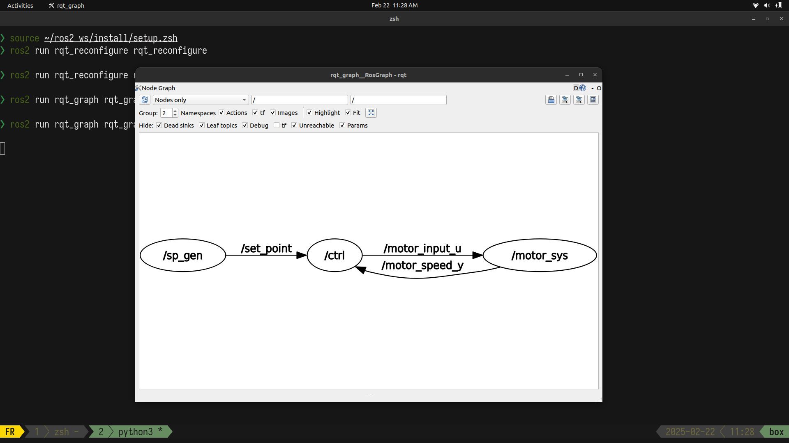
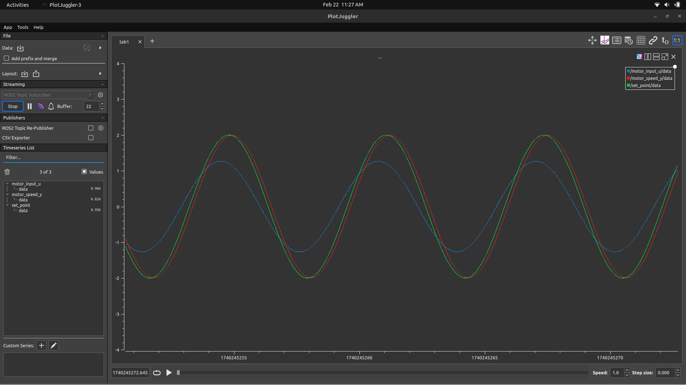
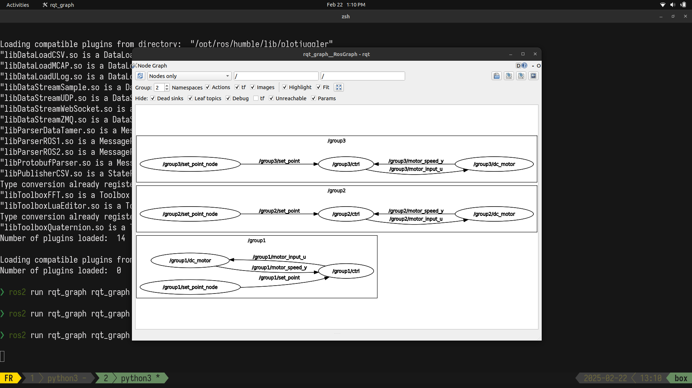
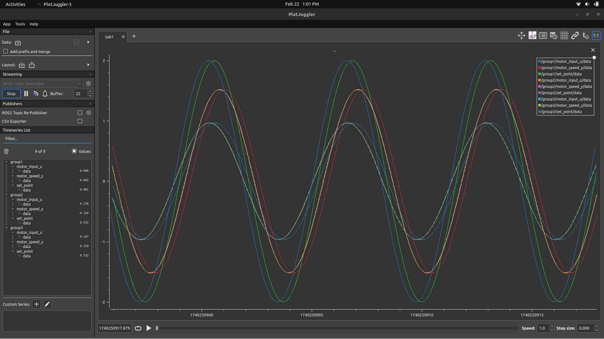
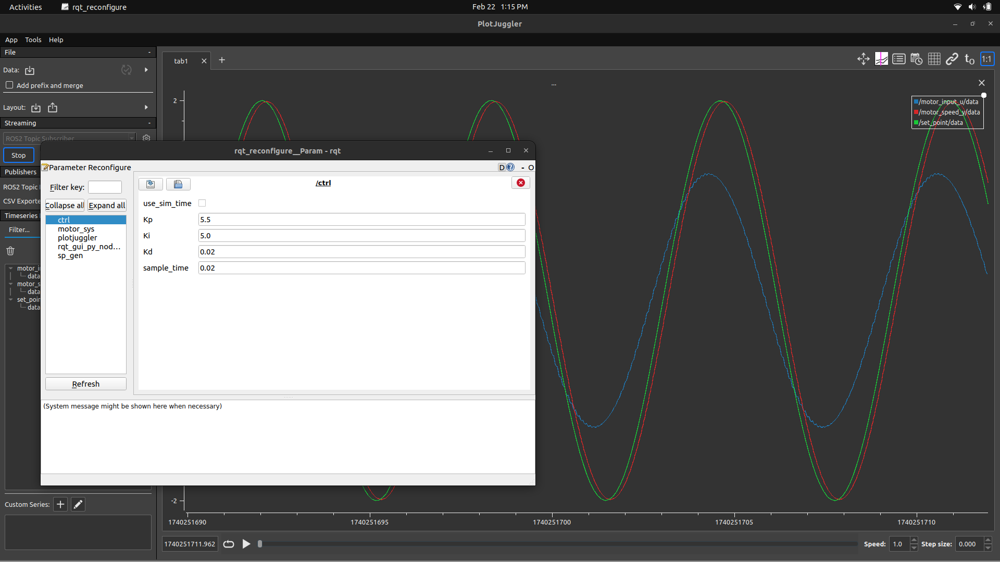

<div align="center">

# MRMiniChallenges

##### Solutions to the mini challenges designed by Manchester Robotics using ROS2 Humble. 

[](#)
[](#)
[](#)

</div>


## Prerequisites

- ROS2 Humble
- Ubuntu 22.04 Jammy
- Python 
- C++
- Text editor 

## Mini challenge 1 


In this challenge, we implemented a ROS2-based signal processing system where:

- A signal generator node publishes a sine wave.
- A processing node applies amplitude reduction, offset, and a phase shift.
- The results are visualized in real-time using PlotJuggler.

Initially, we attempted to use `rqt_plot`, but due to visualization issues, we switched to `PlotJuggler`, which provided a better real-time experience.

```bash
sudo apt install ros-$ROS_DISTRO-plotjuggler-ros
```

This repository includes both Python and C++ implementations of the system. Before running any implementation, make sure to have your environment sourced.


```bash
source /opt/ros/humble/setup.zsh
```

#### Python
```bash
cd ~/MCH1_WS
colcon build --packages-select signal_processing
source install/setup.zsh
ros2 launch signal_processing signal_processing_launch.py
```

Once PlotJuggler is prompted, click the start Button in the left menu, and select the signal and proc_signal topics, then, drag and drop the data into the graph area. 

#### C++
```bash
cd ~/mch1cpp
colcon build --packages-select signal_processing_cpp --symlink-install
source install/setup.zsh
ros2 launch signal_processing_cpp signal_processing_launch.xml
```


Once PlotJuggler is prompted, click the start Button in the left menu, and select the signal and proc_signal topics, then, drag and drop the data into the graph area. 


To visualize the node connections, run:


```bash
ros2 run rqt_graph rqt_graph
```

#### Gallery for mini challenge 1


## Mini challenge 2

This challenge involved designing and tuning a PID controller to regulate the behavior of a simulated DC motor. The objective was to ensure that the motor’s actual speed followed the desired set point as closely as possible.

The system consisted of the following ROS 2 nodes:

- Set Point Generator (sp_gen) → Provides the reference trajectory.
- DC Motor (motor_sys) → Simulates a motor's response to control inputs.
- PID Controller (ctrl) → Adjusts the input voltage (blue line) to make the motor speed match the set point.

Additionally, visualization and monitoring tools were used:

- PlotJuggler → Real-time data visualization.
- rqt_graph → Node and topic structure visualization.
- rqt_reconfigure → Dynamic tuning of PID parameters.


To test the developed solution for the challenge, you can run the following commands after cloning the repo:


```bash 
cd ~/ros2_ws
colcon build --symlink-install
source install/setup.zsh
```

To launch only one group of nodes:
```bash
ros2 launch motor_control motor_launch.py
```

To launch multiple groups of nodes: 
```bash
ros2 launch motor_control challenge_launch.py
```


#### Gallery for mini challenge 2









