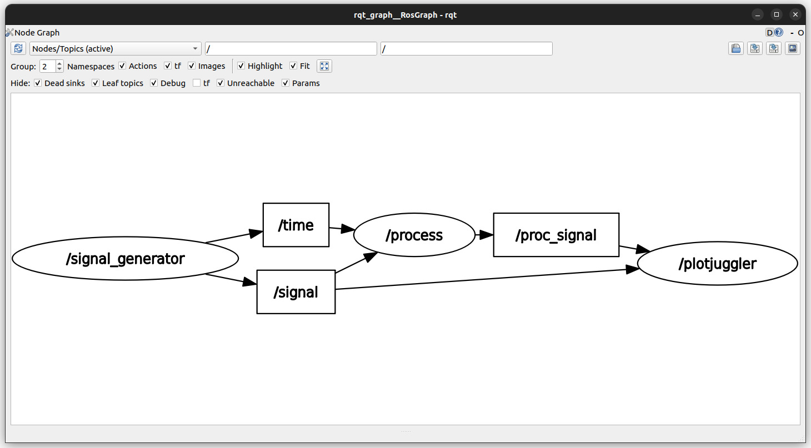
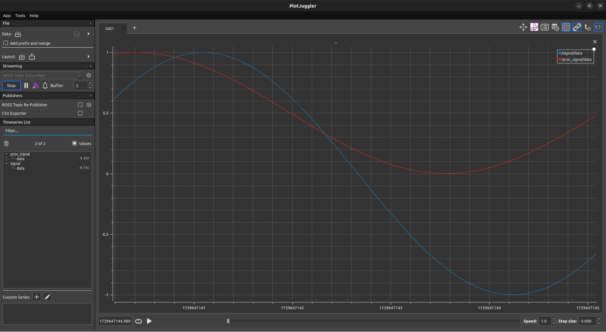

<div align="center">

# MRMiniChallenges

##### Solutions to the mini challenges designed by Manchester Robotics using ROS2 Humble. 

[](#)
[](#)
[](#)

</div>


## Prerequisites

- ROS2 Humble
- Ubuntu 22.04 Jammy
- Python 
- C++
- Text editor 

## Mini challenge 1 


In this challenge, we implemented a ROS2-based signal processing system where:

- A signal generator node publishes a sine wave.
- A processing node applies amplitude reduction, offset, and a phase shift.
- The results are visualized in real-time using PlotJuggler.

Initially, we attempted to use `rqt_plot`, but due to visualization issues, we switched to `PlotJuggler`, which provided a better real-time experience.

```bash
sudo apt install ros-$ROS_DISTRO-plotjuggler-ros
```

This repository includes both Python and C++ implementations of the system. Before running any implementation, make sure to have your environment sourced.


```bash
source /opt/ros/humble/setup.zsh
```

#### Python
```bash
cd ~/MCH1_WS
colcon build --packages-select signal_processing
source install/setup.zsh
ros2 launch signal_processing signal_processing_launch.py
```

#### C++
```bash
cd ~/mch1cpp
colcon build --packages-select signal_processing_cpp --symlink-install
source install/setup.zsh
ros2 launch signal_processing_cpp signal_processing_launch.xml
```

```bash
ros2 run rqt_graph rqt_graph
```

#### Gallery for mini challenge 1


